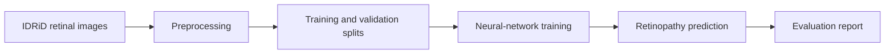

# RetinaForge

> An educational deep-learning project for detecting diabetic retinopathy in
> retinal fundus photographs.

<!-- A RetinaForge eye illustration will be added here later. -->

## Overview

RetinaForge explores how computer-vision models can identify signs of diabetic
retinopathy in retinal fundus images.

The V1 model will classify images as:

- `non_referable_dr`
- `referable_dr`

A future image-quality layer will return `ungradable` when an image is too
blurry, dark, cropped, or otherwise unsuitable for analysis.

## How it works

## Medical safety boundary

RetinaForge does not diagnose diabetes.

Diabetes diagnosis requires appropriate laboratory testing and evaluation by
qualified healthcare professionals. This project is for education and research
and must not be used to make medical decisions.

## Dataset

V1 will use the
[Indian Diabetic Retinopathy Image Dataset](https://idrid.grand-challenge.org/Data/).

The images are not included in this Git repository. Download instructions,
attribution, label definitions, and licensing details are documented in
[`docs/dataset.md`](docs/dataset.md).

## Documentation

- [Project scope](docs/project-scope.md)
- [Dataset](docs/dataset.md)
- [Model](docs/model.md)
- [Evaluation](docs/evaluation.md)
- [Medical safety](docs/safety.md)
- [Learning notes](docs/learning-notes.md)
- [V1 roadmap](docs/roadmap.md)
    
## Project status

RetinaForge V1 is approximately 40% complete. Dataset preparation and integrity
validation are complete; the PyTorch data pipeline is the next phase.

See the [V1 roadmap](docs/roadmap.md) for completed and remaining work.

## Development and review

See [CONTRIBUTING.md](CONTRIBUTING.md) for local checks, configuration handling, and the review workflow.
